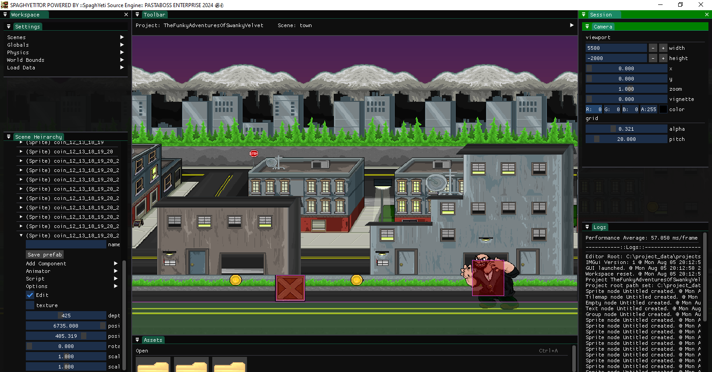
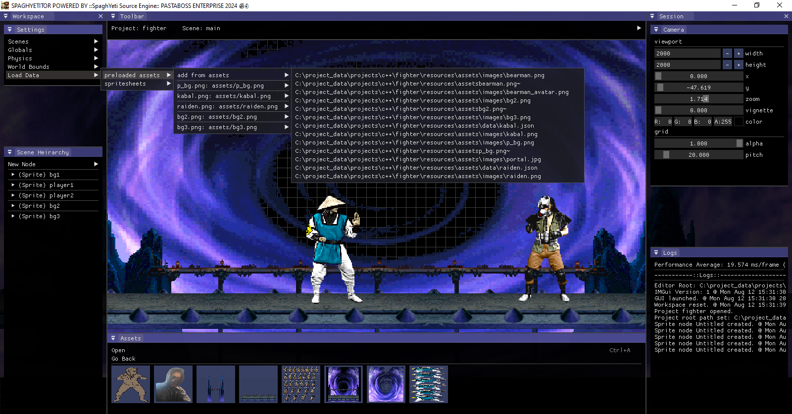
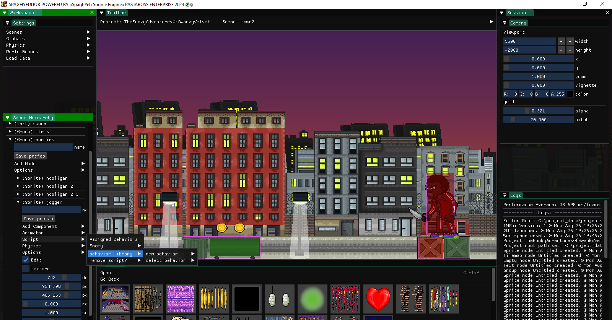
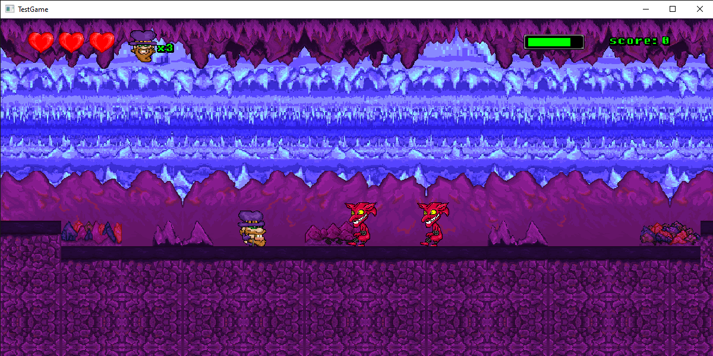
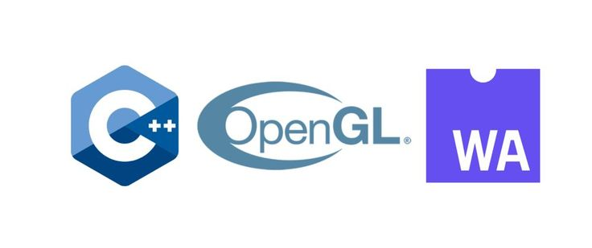

🍝 <::SPAGHYETI SOUЯCE ЭNGINE::> 🍝 

----------------------------------------------------------

Rendering system / content creation tool with audio generation, texturing, and logging. 

Supports loading image, shader, json, and raw byte char files.

Scene heirarchy supports sprites, CSV tilemaps (supports flipped tiles), audio, text, and empty nodes.

Supports native C++ scripting for nodes.

Standalone runtime embedded into application builds, use as core only, or as DLL runtime with editor front end.

Project generation creates base boilerplate and proxy reference to current application, decoupled from core engine source.

Project configurations are saved as a custom ".SPAGHYETI" file which are decrypted into JSON prior to parsing.

Editor created in-scene game objects can be saved as prefabs for repeated use.

For Emscripten WebGL builds, download the latest SDK release, run emsdk install tot, navigate to emscripten install directory, run emcmdprompt.bat and cd to the "web" directory in this tree. compile with that directory's MakeFile.

Requires install of Python 3 to run build scripts

Editor:

Test Game:

---------------------------------------------------------- 

Written by Ross Marinaro - Pastaboss Enterprise 🍝👌

  

----------------------------------------------------------

Libraries used: GLFW / GLAD, GLM, GLText (embedded debug text), FreeType (in-app fonts) STB_IMAGE, MiniAudio, DearIMGUI, Box2D, nlohmann JSON

Requires install of MingW compiler for Windows

----------------------------------------------------------

Notes:

When targeting specific entity from script use `System::Game::GetScene()->GetEntity()`, if targeting a method from another script use `System::Game::GetBehavior()`.
